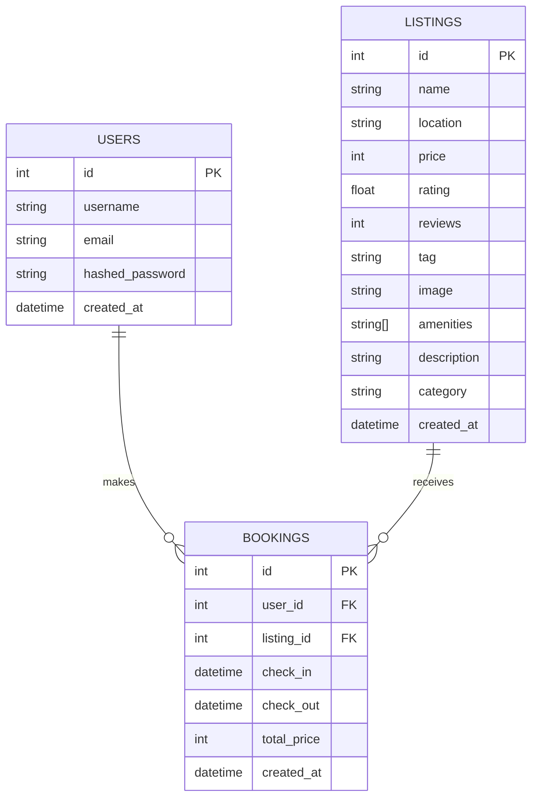

# Database Schema Diagram

This document contains the Entity-Relationship diagram for the StayEase database, modeled in PostgreSQL using SQLAlchemy.

```mermaid
erDiagram
    USERS {
        int id PK
        string username
        string email
        string hashed_password
        datetime created_at
    }

    LISTINGS {
        int id PK
        string name
        string location
        int price
        float rating
        int reviews
        string tag
        string image
        string[] amenities
        string description
        string category
        datetime created_at
    }

    BOOKINGS {
        int id PK
        int user_id FK
        int listing_id FK
        datetime check_in
        datetime check_out
        int total_price
        datetime created_at
    }

    USERS ||--o{ BOOKINGS : "makes"
    LISTINGS ||--o{ BOOKINGS : "receives"
```
